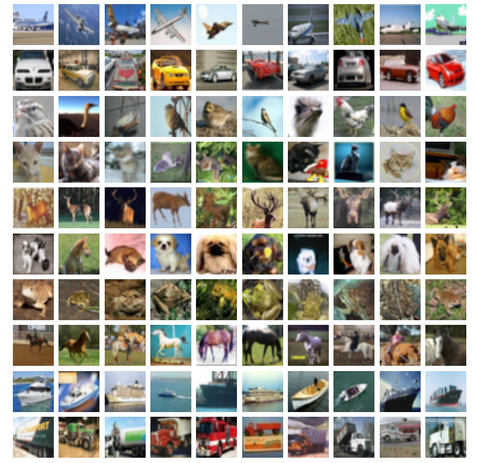
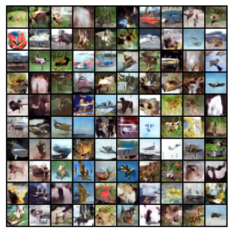

# GAN-CIFAR10
GAN implementation for CIFAR10 image dataset

#CIFAR-10
The cifar 10 images containes like these.

#Generated Images from GAN.
The generated images from GAN are like these.

#Training.
1) Used BCE for both generator and Discriminator.
2) Used different Adam optimizers for both of them
3) Tried different Transformations, but not useful. So just mean normalization is used.
4) For each batch, only one time both will get updated.( May be one can try updated Generator for more times than Discriminator for best results.)

Thanks for multiple open source blogs, for the help of this project.
